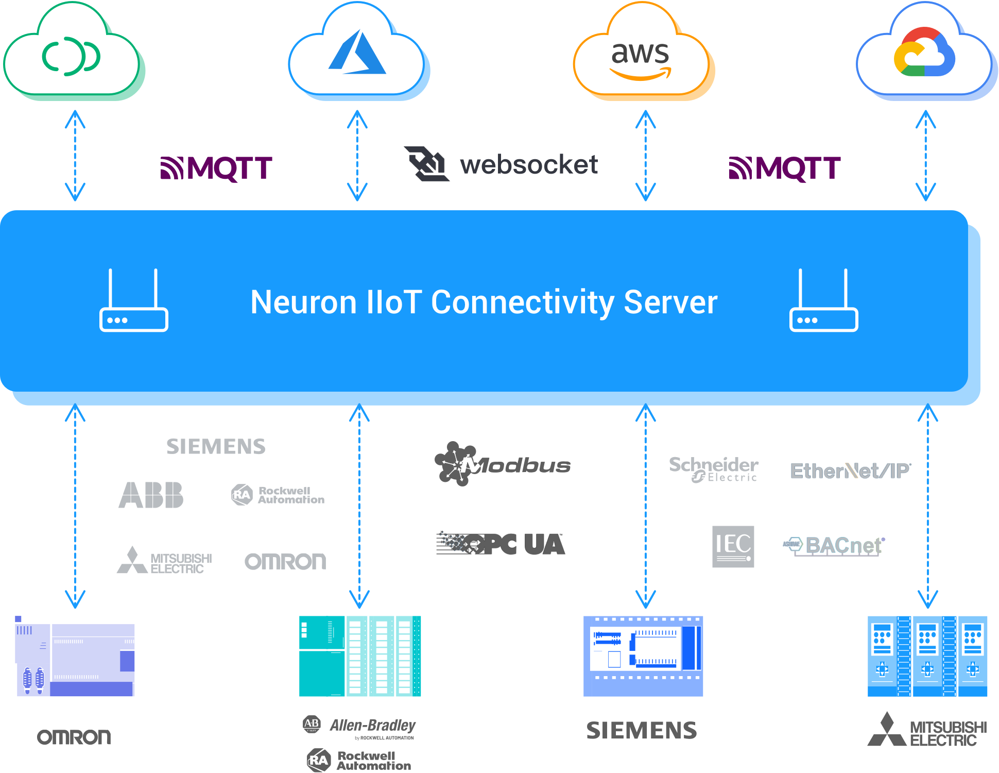

# Neuron

[](https://github.com/neugates/neuron/releases)
[](https://hub.docker.com/r/emqx/neuron)
[](https://slack-invite.emqx.io/)
[](https://discord.gg/xYGf3fQnES)
[](https://twitter.com/EMQTech)
[](https://www.youtube.com/channel/UC5FjR77ErAxvZENEWzQaO5Q)


[English](https://github.com/emqx/neuron/blob/main/README.md) | 简体中文

Neuron 是一款开源的、轻量级工业协议网关软件，支持数十种工业协议的一站式设备连接、数据接入、MQTT 协议转换，为工业设备赋予工业 4.0 时代关键的物联网连接能力。



以下是 Neuron 的一些重要特性：

- 具有实时能力的边缘原生应用程序可以利用边缘端的低延迟网络。
- 松耦合模块化架构设计，通过可插拔模块扩展更多功能服务。
- 支持可以在运行时更新设备和应用程序模块的热插件。
- 支持多种工业设备协议，包括 Modbus、OPCUA、Ethernet/IP、IEC104、BACnet 等。
- 支持同时连接大量不同协议的工业设备。
- 结合[eKuiper](https://www.lfedge.org/projects/ekuiper)提供的规则引擎功能，快速实现基于规则的设备控制或 AI/ML 分析。
- 通过 SparkplugB 解决方案支持对工业应用程序的数据访问，例如 MES 或 ERP、SCADA、historian 和数据分析软件。
- 具有非常低的内存占用，小于 10M 的内存占用和 CPU 使用率，可以在 ARM、x86 和 RISC-V 等资源有限的硬件上运行。
- 支持在本地安装可执行文件或部署在容器化环境中。
- 控制工业设备，通过 [HTTP API](docs/api/cn/http.md) 和 [MQTT API](docs/api/cn/mqtt.md) 服务更改参数和数据标签。
- 与其他 EMQ 产品高度集成，包括  [EMQX](https://www.emqx.com/zh/products/emqx)、[NanoMQ](https://nanomq.io/zh)、[eKuiper](https://ekuiper.org/zh)。
- 核心框架和 Modbus、MQTT 和 eKuiper 的代码在 LGPLv3 的许可下开源。

开源版本只提供了部分插件，要使用更多的插件以及更完善的 Dashboard，请使用 [NeuronEX](https://www.emqx.com/zh/products/neuronex)。

## 快速开始

Neuron 管理面板的默认登陆账号为 `admin`，密码为 `0000`。

### 下载 tar 包运行

选择 [Relase](https://github.com/emqx/neuron/releases) 版本下载

```bash
$ tar xvf neuron-{version}-linux-amd64.tar.gz
$ cd neuron
$ ./neuron --log
```

浏览器中打开 `http://localhost:7000` 访问 Neuron。


### 源码编译运行

1. [安装依赖](https://github.com/emqx/neuron/install-dependencies.md)

2. 编译 Neuron
```bash
$ git clone https://github.com/emqx/neuron
$ cd neuron && mkdir build && cd build
$ cmake .. && make
```

3. 下载并解压 Dashboard 
```bash
$ wget https://github.com/emqx/neuron-dashboard/releases/download/2.6.3/neuron-dashboard.zip

# 解压 neuron-dashboard.zip 到 build 目录
$ unzip neuron-dashboard.zip
```

3. 运行 Neuron
```bash
$ ./neuron --log
```

4. 浏览器中打开 `http://localhost:7000` 访问 Neuron。

### Docker

```bash
$ docker run -d --name neuron -p 7000:7000 emqx/neuron:2.6.9
```

目前 Neuron 维护的最新镜像是 emqx/neuron:2.6.9，2.7.x 及后续的版本不再提供镜像。

### [采集 Modbus TCP 数据并通过 MQTT 发送](./docs/quick_start/quick_start_cn.md)

## Dashboard

开源版 [Dashboard](https://github.com/emqx/neuron-dashboard) 最新 Release 的版本为 2.6.3，目前已暂停开发与维护，此版本也是 Neuron 默认集成的版本。要用更完善与更专业的 Dashboard，请使用 [NeuronEX](https://www.emqx.com/zh/products/neuronex)。


## 社区

- 访问 [Neuron 论坛](https://askemq.com/c/neuron/8) 以获取帮助，也可以分享您的想法或项目。
- 添加小助手微信号 `emqmkt`，加入 Neuron 微信技术交流群。
- 加入我们的 [Discord](https://discord.gg/xYGf3fQnES)，参于实时讨论。
- 关注我们的 [bilibili](https://space.bilibili.com/522222081)，获取最新物联网技术分享。
- 关注我们的 [微博](https://weibo.com/emqtt) 或 [Twitter](https://twitter.com/EMQTech)，获取 Neuron 最新资讯。


## 开源许可

详见 [LICENSE](./LICENSE)。
